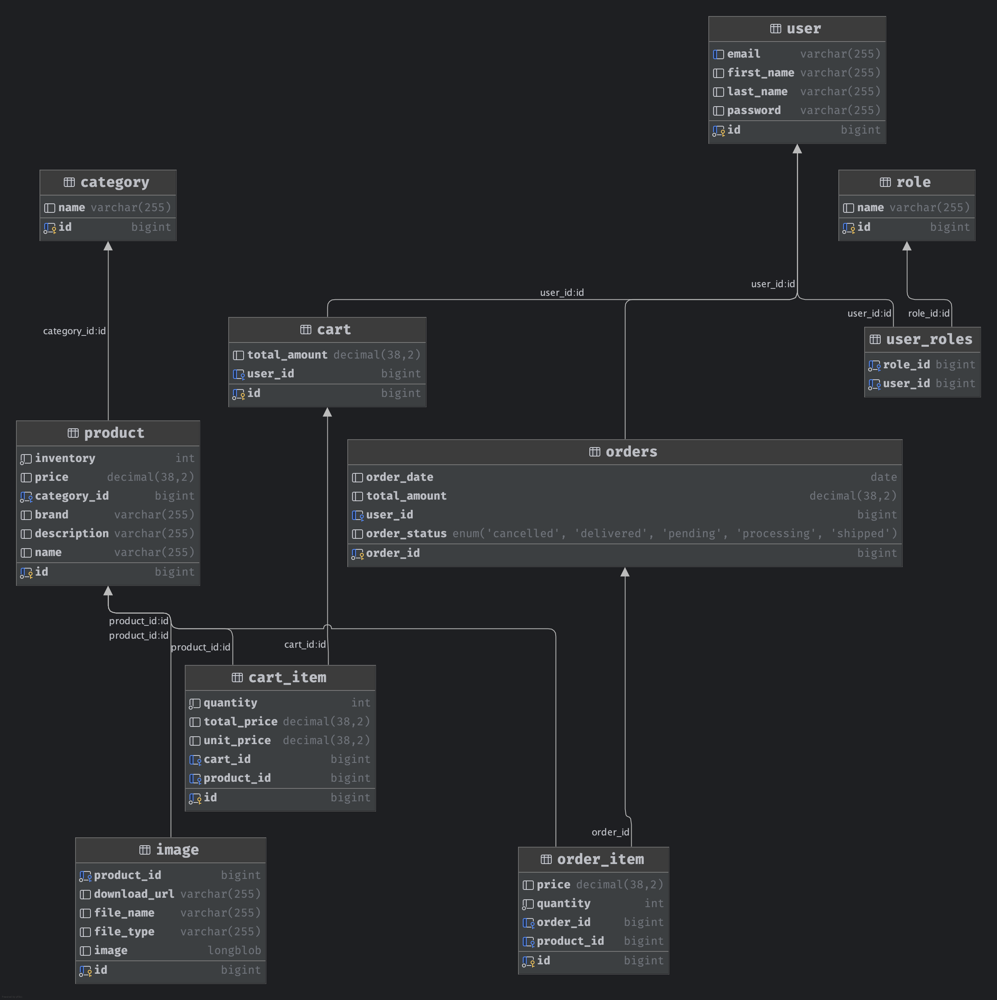
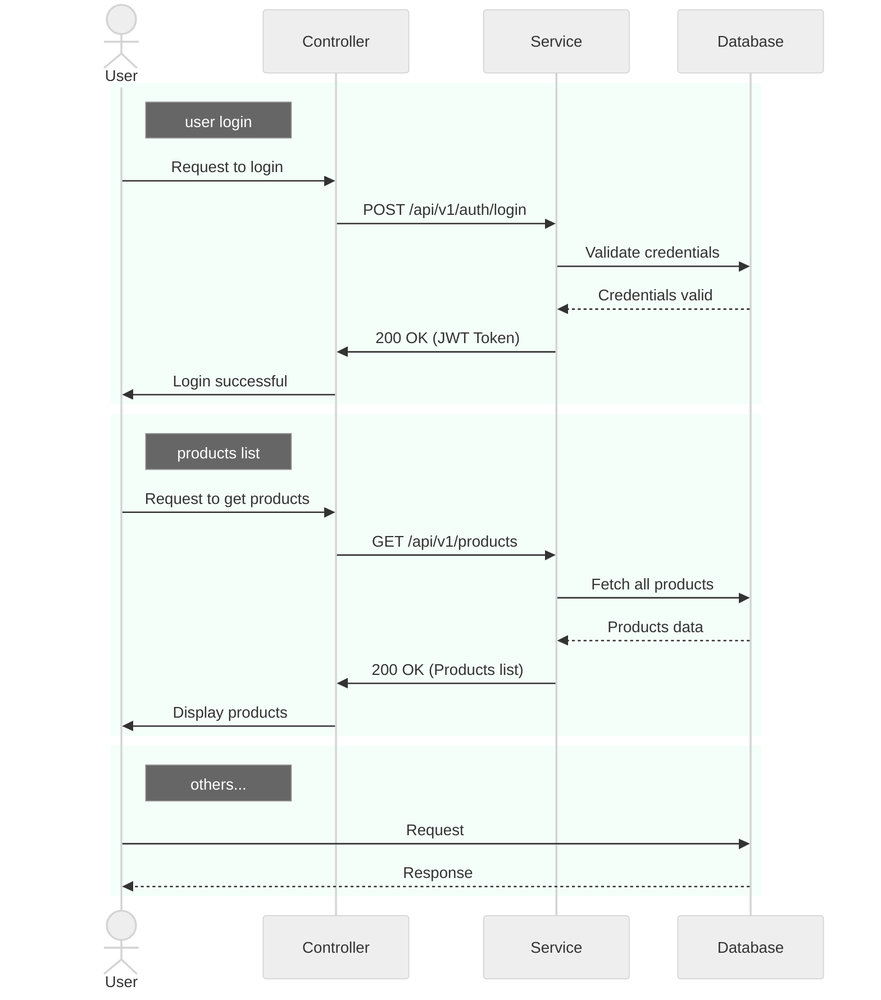

<div align="center">

# Dream Shops

</div>

## 1. Database setup

<details>

<summary>MySQL</summary>

```bash
docker run -itd --name mysql-test -p 3306:3306 -e MYSQL_ROOT_PASSWORD=123456 mysql
```

</details>



## 2. Project setup

<details>

```bash
./mvnw spring-boot:run #visit http://localhost:8080/swagger-ui/index.html
```

</details>

### 2.1 Project structure

```bash
dream-shops/
├── src/
│   ├── main/
│   │   ├── java/
│   │   │   └── com/
│   │   │       └── hippiezhou/
│   │   │           └── dreamshops/
│   │   │               ├── config/
│   │   │               ├── controller/
│   │   │               ├── dto/
│   │   │               ├── mapper/
│   │   │               ├── service/
│   │   │               │   └── impl/
│   │   │               ├── repository/
│   │   │               ├── model/
│   │   │               ├── remote/
│   │   │               │   └── impl/
│   │   │               └── DreamShopsApplication.java
│   │   └── resources/
│   │       ├── application.yml
│   │       └── static/
│   └── test/
│       └── java/
│           └── com/
│               └── hippiezhou/
│                   └── dreamshops/
├── .gitignore
├── README.md
└── pom.xml
```

### 2.2 Sequence Diagram



## Docs

- [Spring Boot, Spring Security, JWT Course – Shopping Cart Backend Java Project](https://www.youtube.com/watch?v=oGhc5Z-WJSw&ab_channel=freeCodeCamp.org)
- [搭建第一个Spring Boot项目](https://javabetter.cn/springboot/initializr.html)
- [](https://javabetter.cn/home.html)
- [](https://start.spring.io/)
- [](https://github.com/dailycodework/dream-shops)
- [](https://springdoc.org/)